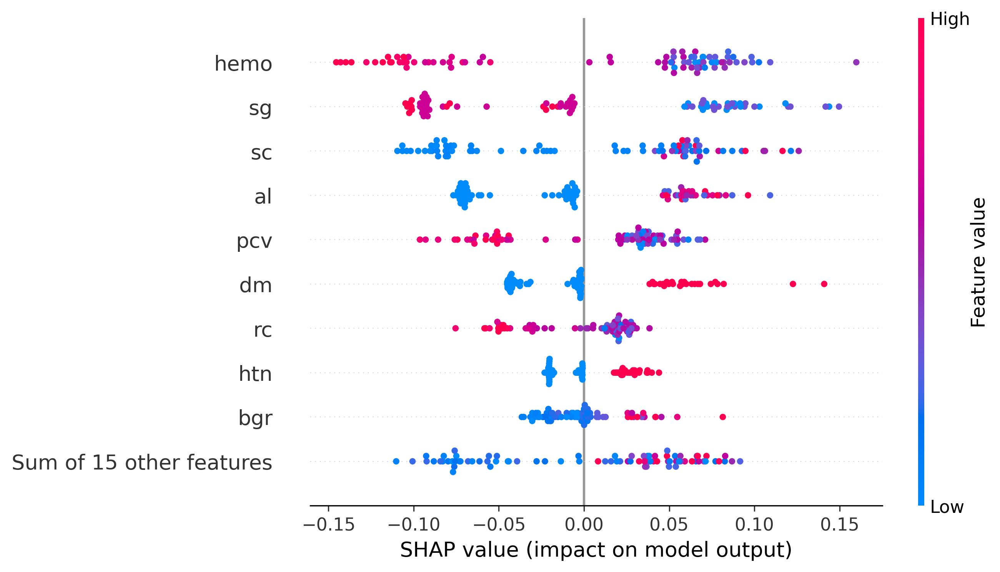
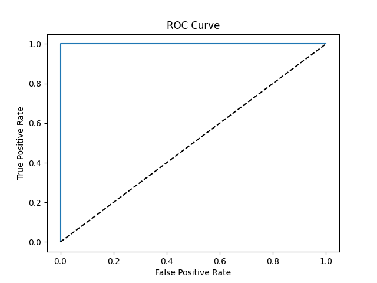
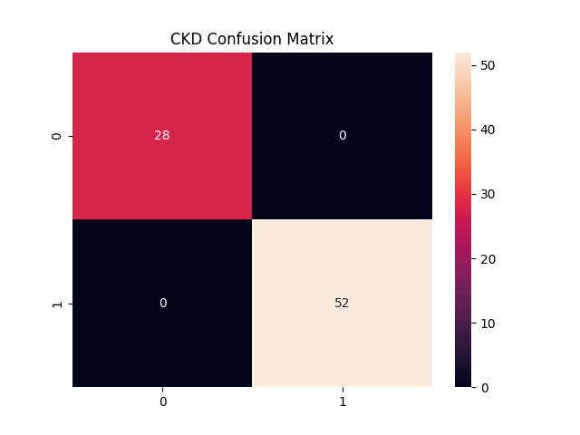
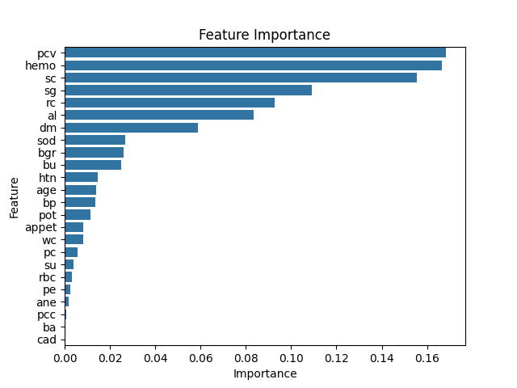
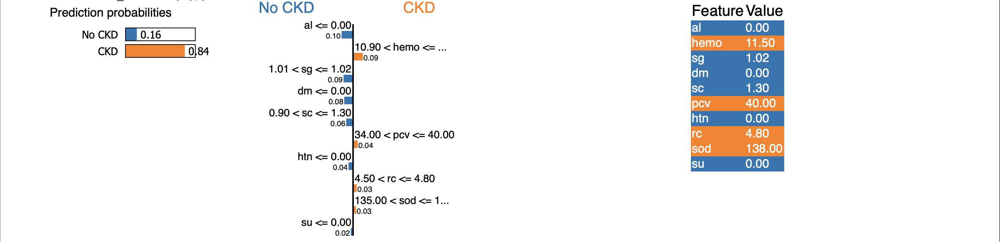

# 🧠 Explainable Multi-Disease Prediction using Machine Learning, SHAP and LIME

👩‍💻 Author: Megha K A

⸻

# 📌 Project Overview

This project presents an Explainable Artificial Intelligence (XAI) framework for multi-disease prediction using Machine Learning integrated with SHAP and LIME interpretability techniques.

The system focuses on predicting:

* 🩺 Diabetes Mellitus
* 🩺 Chronic Kidney Disease (CKD)

The primary goal of this project is not only to achieve strong predictive performance but also to improve:

* Transparency
* Interpretability
* Trustworthiness
* Clinical understanding in Healthcare AI systems

By integrating Explainable AI techniques, the project demonstrates how Machine Learning predictions can become more understandable for healthcare analytics and clinical decision-support applications.

⸻

# 🎯 Objectives

* Develop a multi-disease healthcare prediction framework
* Predict Diabetes and Chronic Kidney Disease using Machine Learning
* Apply Explainable AI techniques for model transparency
* Compare Machine Learning model performance
* Analyze feature importance affecting disease prediction
* Improve trustworthiness in healthcare AI systems
* Demonstrate interpretable AI-assisted healthcare prediction

⸻

# 🗂️ Datasets Used

 1️⃣ Diabetes Dataset

Training Dataset

* File: diabetes-train.csv
* Records: 70,692
* Features: 22
* Balanced dataset

Testing Dataset

* File: diabetes-test.csv
* Records: 253,680
* Features: 22
* Real-world imbalanced dataset

Features Include

* High Blood Pressure
* High Cholesterol
* BMI
* Smoking Habit
* Stroke History
* Physical Activity
* General Health
* Mental Health
* Age
* Income
* Education

⸻

 2️⃣ Chronic Kidney Disease Dataset

File

* kidney_disease.csv
* Records: 400
* Features: 25
* Source: UCI Machine Learning Repository

 Important Clinical Features

* Hemoglobin
* Specific Gravity
* Blood Urea
* Serum Creatinine
* Packed Cell Volume
* Hypertension
* Potassium
* Red Blood Cell Count

⸻

# 🛠️ Technologies Used

* Python
* Pandas
* NumPy
* Matplotlib
* Seaborn
* Scikit-learn
* XGBoost
* SHAP
* LIME
* Jupyter Notebook
* Google Colab

⸻

# ⚙️ Machine Learning Workflow

🔹 Data Preprocessing

* Missing value handling
* Data cleaning
* Feature encoding
* Numerical conversion
* Dataset splitting
* Data normalization

⸻

🔹 Models Implemented

* Logistic Regression
* Decision Tree Classifier
* Random Forest Classifier
* XGBoost Classifier

⸻

🔹 Explainable AI Techniques

* SHAP (SHapley Additive Explanations)
* LIME (Local Interpretable Model-agnostic Explanations)

⸻

# 📊 Model Evaluation

The models were evaluated using:

* Accuracy Score
* Precision
* Recall
* F1 Score
* ROC-AUC Score
* Confusion Matrix
* Cross Validation

⸻

# 🔍 Explainable AI Analysis

This project applies Explainable AI methods to interpret disease prediction outcomes.

⸻

# 🌐 SHAP Analysis

SHAP was used for:

* Global feature importance analysis
* Model behavior interpretation
* Clinical feature contribution analysis
* Transparent healthcare prediction explanation

⸻

# 🧩 LIME Analysis

LIME was used for:

* Local prediction explanations
* Patient-level prediction interpretation
* Feature influence visualization

⸻

# 📈 Visualizations

🔹 SHAP Summary Plot

The SHAP summary plot demonstrates the global impact of clinical features influencing disease prediction outcomes.

⸻

🔹 ROC Curve

The ROC Curve demonstrates the classification capability of the Machine Learning models.

⸻

🔹 Confusion Matrix

The confusion matrix visualizes classification performance and prediction accuracy.

⸻

🔹 Feature Importance Plot

Feature importance analysis identifies the most influential healthcare variables contributing to disease prediction.

⸻

🔹 Lime Explanation Plot

LIME (Local Interpretable Model-Agnostic Explanations) was applied to generate local patient-level prediction explanations.

⸻

## ✨ Key Features of the Project

* Multi-disease healthcare prediction
* Explainable AI integration
* SHAP global interpretability
* LIME local interpretability
* Real-world healthcare dataset analysis
* Machine Learning model comparison
* Transparent healthcare risk prediction
* AI-assisted clinical decision-support framework

⸻

## 📂 Repository Structure

Explainable-Healthcare-AI-MultiDisease/
│
├── datasets/
│   ├── diabetes-train.csv
│   ├── diabetes-test.csv
│   └── kidney_disease.csv
│
├── diagrams/
│   ├── shap_summary_ckd.png
│   ├── roc_curve_models.png
│   ├── confusion_matrix_rf.png
│   └── feature_importance.png
│
├── Explainable_MultiDisease_Prediction_SHAP_LIME.ipynb
│
├── requirements.txt
│
└── README.md

⸻

# 🚀 Future Improvements

* Deep Learning-based disease prediction
* Real-time healthcare analytics
* Multi-class disease prediction
* Federated healthcare AI systems
* Advanced explainability frameworks
* Clinical deployment validation
* Healthcare dashboard integration

⸻

# 📚 Research Significance

This project demonstrates how Explainable AI can improve transparency and interpretability in healthcare Machine Learning systems.

Unlike traditional black-box AI models, SHAP and LIME explanations provide meaningful insights into disease prediction decisions, helping improve trust and understanding in AI-assisted healthcare systems.

The project highlights the importance of combining:

* Predictive performance
* Clinical interpretability
* Explainability
* Trustworthy healthcare AI systems

⸻

# 👩‍💻 Author

Megha K A

Machine Learning | Explainable AI | Healthcare AI | Clinical Decision Suppo

# 🍴 Fork This Repository

If you find this project useful for healthcare AI, Explainable AI research, or machine learning learning purposes, feel free to fork and build upon this repository.

Steps to Fork

1. Click the Fork button at the top-right corner of this repository.
2. Clone your forked repository:

git clone https://github.com/your-username/Explainable-Healthcare-AI-MultiDisease.git

3. Open the notebook using Google Colab or Jupyter Notebook.
4. Install required dependencies:

pip install -r requirements.txt

5. Run the notebook cells sequentially to reproduce the multi-disease prediction and explainability workflow.
